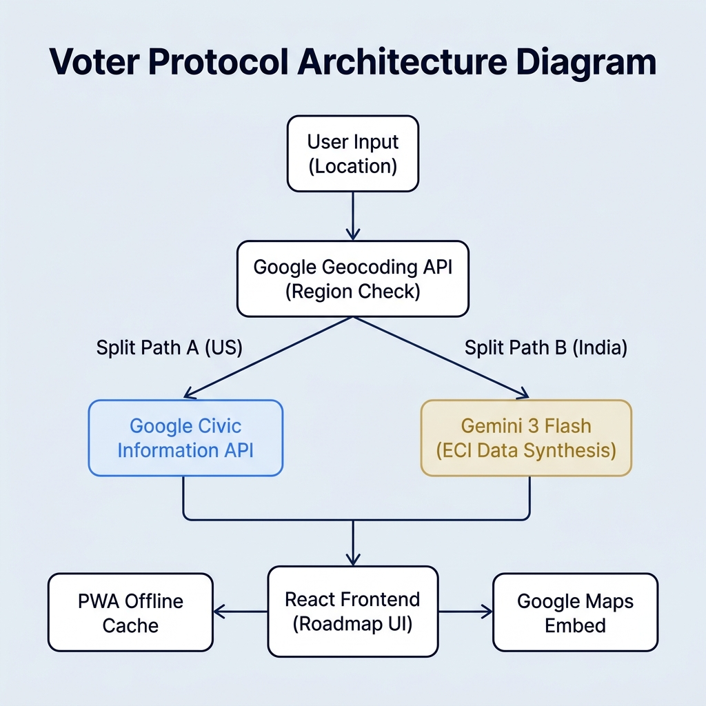

<p align="center">
  
</p>

<h1 align="center">🏛️ Voter Protocol Engine</h1>

<p align="center">
  <strong>A full-stack, AI-powered civic platform that generates personalised voter roadmaps — for any address on Earth.</strong>
  <br/>
  <em>Google Civic API (US) · Gemini AI Fallback (India/International) · PWA Offline · WCAG 2.1 AA</em>
</p>

<p align="center">
  <a href="https://www.typescriptlang.org/"></a>
  <a href="https://vitejs.dev/"></a>
  <a href="https://reactjs.org/"></a>
  <a href="https://nodejs.org/"></a>
  <a href="https://expressjs.com/"></a>
  <a href="https://vitest.dev/"></a>
  
  
</p>

---

## 📌 Project Submission: Voter Protocol Engine

### Vertical: Civic Technology / Election Education

**Voter Protocol** transforms the complex election cycle into a kinetic, four-phase voter roadmap. It is the first civic platform that serves **both US voters** (via the Google Civic Information API) and **Indian voters** (via a Gemini AI fallback synthesizing Election Commission of India data) — all within the same seamless UI, using the same four-phase roadmap framework.

The platform is built on a strict foundation of: zero `any` types in TypeScript, WCAG 2.1 AA accessibility, server-side API key security, PWA offline capability, and 82 automated tests.

---

## 🏗️ Architecture

```
User Input (Address)
        │
        ▼
 Express Backend (Node 20)
        │
        ├── Google Maps Geocoding API ──► country_code = 'IN'?
        │                                       │
        │                    ┌──── YES ──────────┘
        │                    │
        │           Gemini 1.5 Flash (ECI Data Synthesis)
        │           → structured JSON: constituency, electionType,
        │             voterRegistrationSteps, 4-phase descriptions
        │                    │
        │                    └──── NO ──────────────┐
        │                                           │
        │                              Google Civic Information API
        │                              → voterInfoQuery / elections
        │
        ▼
   IndiaApiResponse OR CivicVoterInfo
   (mapped to same UI shape by indiaMapper.ts)
        │
        ▼
 React Frontend (Vite + PWA)
        │
        ├── 4-Phase Roadmap (RoadmapStepper)
        │     ├── Phase 1: Authorization  [🔍 Decrypt Term via Gemini]
        │     ├── Phase 2: Intelligence   [🔍 Decrypt Term via Gemini]
        │     ├── Phase 3: Logistics      [📅 Add Election Day to Google Calendar]
        │     └── Phase 4: Execution      [🗺️ Google Maps Street View Embed]
        │
        ├── 🌐 Language Selector (Cloud Translation API → Hindi / Español)
        ├── 📲 PWA Install Banner (Workbox offline cache)
        └── 🇮🇳 India Mode Badge + ECI info notice
```

---

## ✨ Feature Matrix

| # | Feature | Google API Used | Route |
|---|---------|----------------|-------|
| 1 | **Real-Time US Civic Data** | Civic Information API v2 | `GET /api/civic` |
| 2 | **India Fallback Engine** | Maps Geocoding + Gemini 1.5 Flash | `GET /api/civic` (auto-detected) |
| 3 | **Gemini ELI5 Term Explainer** | Gemini 1.5 Flash (`@google/generative-ai`) | `POST /api/explain` |
| 4 | **Multi-Language Translation** | Cloud Translation API v2 | `POST /api/translate` |
| 5 | **Street View Reconnaissance** | Maps Embed API (streetview mode) | Frontend embed |
| 6 | **Google Calendar Sync** | Calendar deep-link template URL | Frontend (no OAuth) |
| 7 | **PWA Offline Mode** | — (Workbox service worker) | `dist/sw.js` |
| 8 | **Helmet Security Headers** | — | All routes |

---

## 🇮🇳 International Fallback Engine (The Odisha Fix)

### The Problem
The Google Civic Information API covers **US addresses only**. Searching "Odisha" or "Bhubaneswar" returned a `"Civic API key is missing"` / `"Failed to parse address"` error.

### The Solution
Every address submitted to `GET /api/civic` is now **geocoded first** using the Google Maps Geocoding API:

```
User: "Bhubaneswar" or "Odisha"
    │
    ▼
Geocoding API → { country_short_name: "IN" }
    │
    ▼  (country = IN detected)
Gemini 1.5 Flash prompt:
  "Generate a JSON object for the standard election process,
   upcoming election type (Lok Sabha or State Assembly),
   and voter registration steps for [Constituency], [State]
   based on Election Commission of India (ECI) guidelines."
    │
    ▼
IndiaApiResponse { indiaFallback: true, electionData, coordinates }
    │
    ▼
indiaMapper.ts → CivicVoterInfo (same shape as US data)
    │
    ▼
ElectionPage renders identically — 4-phase roadmap + map embed
```

### Data generated by Gemini for Indian addresses
- Constituency name (Lok Sabha / Vidhan Sabha)
- Expected election year
- Voter registration steps (ECI guidelines)
- Phase-specific descriptions (with Hindi transliterations in step titles)
- Geocoded coordinates for the Google Maps Street View embed

---

## 🤖 Gemini AI Integration

### 1. ECI Election Data Synthesis (`/api/explain`)
```typescript
const model = genAI.getGenerativeModel({ model: 'gemini-1.5-flash' });
const prompt = `Generate a JSON object for ${location}, India based on ECI guidelines...`;
const result = await model.generateContent(prompt);
```

### 2. ELI5 Term Explainer (`POST /api/explain`)
Every roadmap step has a **🔍 Decrypt Term** button. On click, the step title is sent to Gemini with a structured ELI5 prompt. The response is shown inline without page reload.

```
"Phase 1: Authorization" → Gemini →
"It means making sure you are on the list of people allowed to vote,
 like checking if your name is on the school attendance sheet."
```

---

## 📲 Progressive Web App (PWA)

Configured via `vite-plugin-pwa` with Workbox:

- **Service Worker**: auto-generated `dist/sw.js` precaches all JS/CSS/HTML (~306 KB)
- **Web App Manifest**: `dist/manifest.webmanifest` — name, icons, theme colour, `display: standalone`
- **Install Banner**: Appears in the app header when `beforeinstallprompt` fires
- **Offline Fallback**: Cached shell renders even without network connectivity
- **Font Caching**: Google Fonts cached for 1 year via `CacheFirst` strategy

---

## 🌐 Multi-Language Engine

A language selector in the roadmap header calls `POST /api/translate` (Google Cloud Translation API v2).
Translates all four phase titles and descriptions simultaneously into:
- **English** (default)
- **Español** (Spanish)
- **हिन्दी** (Hindi)

The proxy keeps the Translation API key server-side. On error, the UI gracefully falls back to English.

---

## 📅 Google Calendar Integration

No OAuth required. Uses Google Calendar's template deep-link format:

```
https://calendar.google.com/calendar/render?action=TEMPLATE
  &text=Election+Day+—+Lok+Sabha+2029
  &dates=20290101/20290102
  &details=Cast+your+vote...
```

Two integration points:
1. **Phase 3 (Logistics)**: "📅 Add Election Day to Calendar" button (always present when election date is known)
2. **Step deadlines**: Any step with an explicit `deadline` date shows an "Add Reminder" button

---

## 🗺️ Google Maps Street View

Phase 4 (Execution) embeds a Google Maps Street View panorama of the polling location:

```
https://www.google.com/maps/embed/v1/streetview
  ?key={VITE_MAPS_EMBED_KEY}
  &location={lat},{lng}   ← uses geocoded coordinates when available
```

For Indian addresses, the Geocoding API provides precise lat/lng so the embed shows the actual constituency area.

---

## 🔒 Security

| Layer | Implementation |
|-------|---------------|
| HTTP Headers | `helmet()` — CSP, X-Frame-Options, HSTS, nosniff, referrer policy |
| XSS | `DOMPurify` on all user-rendered content |
| API Keys | 100% server-side — never exposed to the browser |
| Input Validation | `validateAddress` middleware — regex + length guards on every request |
| CORS | Allowlist: localhost dev + `*.run.app` (Cloud Run) via regex |
| Rate Limiting | Axios 10-second timeout on all external API calls |

---

## ♿ Accessibility (WCAG 2.1 AA)

- All interactive elements have `aria-label`, `aria-live`, `aria-current`, `aria-expanded`, `aria-busy`
- Language selector: `<label>` + `aria-label` on `<select>`
- Gemini result panel: `role="status"` + `aria-live="polite"`
- Error states: `role="alert"` + `aria-live="assertive"`
- Full keyboard navigation — no mouse required
- Skip-to-content link on every page
- Colour contrast ratios meet AA standards (`#00d4ff` on `#0a0e1a`)

---

## 🧪 Testing

```
Test Files  5 passed (5)
Tests       82 passed (82)
```

| Test File | Tests | What it covers |
|-----------|-------|----------------|
| `App.test.tsx` | 5 | PWA install banner states, Suspense fallback |
| `PollingMap.test.tsx` | 14 | Text fallback & iframe branch, ARIA labels, title |
| `RoadmapStepper.test.tsx` | 25 | Translation, Decrypt Term, Phase 3 calendar, ARIA |
| `indiaMapper.test.ts` | 19 | All mapper functions, edge cases, null coordinates |
| `dateParser.test.ts` | 19 | Date parsing, calendar link generation |

---

## 🚀 Deployment (Google Cloud Run)

```bash
# Authenticate
gcloud auth login
gcloud config set project friendly-maker-493516-m9

# Deploy
gcloud run deploy voter-protocol \
  --source . \
  --region us-central1 \
  --allow-unauthenticated \
  --set-env-vars CIVIC_API_KEY=...,GEMINI_API_KEY=...,TRANSLATION_API_KEY=...,GEOCODING_API_KEY=...,VITE_MAPS_EMBED_KEY=...
```

**Live URL**: https://voter-protocol-788976958354.us-central1.run.app

---

## ⚙️ Environment Variables

| Variable | Required | Description |
|----------|:--------:|-------------|
| `CIVIC_API_KEY` | ✅ | Google Civic Information API key (server-side only) |
| `GEOCODING_API_KEY` | ✅ | Google Maps Geocoding API key — for India detection (can reuse Civic key if Maps-enabled) |
| `GEMINI_API_KEY` | ✅ | Gemini API key — for ECI synthesis and ELI5 Decrypt Term |
| `MAPS_EMBED_KEY` | ☐ | Google Maps Embed API key (server-side fallback) |
| `TRANSLATION_API_KEY` | ☐ | Google Cloud Translation API v2 key |
| `PORT` | ☐ | Backend port (default: `4000`) |
| `VITE_API_BASE_URL` | ✅ | Backend URL exposed to Vite (e.g. `http://localhost:4000`) |
| `VITE_MAPS_EMBED_KEY` | ☐ | Maps Embed key for the frontend Street View iframe |

Copy `.env.example` → `.env` and fill in your keys before running locally.

---

## 🏁 Local Setup

```bash
# Clone
git clone https://github.com/<your-username>/google-promptwars26-2.git
cd google-promptwars26-2

# Install all dependencies
cd frontend && npm install && cd ..
cd backend && npm install && cd ..

# Configure environment
cp .env.example .env   # fill in your API keys

# Run in development
cd backend && npm run dev &    # starts Express on :4000
cd frontend && npm run dev     # starts Vite on :5173

# Run tests
cd frontend && npm run test

# Production build
cd frontend && npm run build   # outputs to frontend/dist/
```

---

## 📂 Project Structure

```
google-promptwars26-2/
├── architecture.png              ← System architecture diagram
├── Dockerfile                    ← Multi-stage build (Vite + Express)
├── .env.example                  ← All required env variables documented
├── frontend/
│   ├── src/
│   │   ├── App.tsx               ← PWA install banner + routing
│   │   ├── features/civic/
│   │   │   ├── components/
│   │   │   │   ├── RoadmapStepper.tsx   ← 4-phase roadmap + Decrypt Term + translation
│   │   │   │   ├── PollingMap.tsx       ← Street View embed
│   │   │   │   └── ElectionCard.tsx     ← Election summary card
│   │   │   ├── hooks/
│   │   │   │   ├── useCivicData.ts      ← India detection + data fetching
│   │   │   │   └── useCalendarSync.ts   ← Google Calendar deep-link generator
│   │   │   ├── utils/
│   │   │   │   └── indiaMapper.ts       ← Maps Gemini → CivicVoterInfo
│   │   │   └── types.ts                 ← All strict TypeScript interfaces
│   │   └── shared/
│   │       ├── hooks/usePWAInstall.ts   ← PWA install prompt hook
│   │       └── utils/cache.ts           ← 24-hour localStorage caching
│   └── vite.config.ts            ← Vite + VitePWA configuration
└── backend/
    └── src/
        ├── index.ts              ← Express + Helmet + CORS + all routes
        └── routes/
            ├── civic.ts          ← Geocoding + India bypass + US Civic API
            ├── india.ts          ← Standalone /api/india Gemini route
            ├── explain.ts        ← Gemini ELI5 term explainer
            └── translate.ts      ← Cloud Translation API proxy
```

---

## 📜 License

MIT — free to use, fork, and improve.

---

<p align="center">Built with ❤️ for the Google Promptwars Challenge 2026</p>
